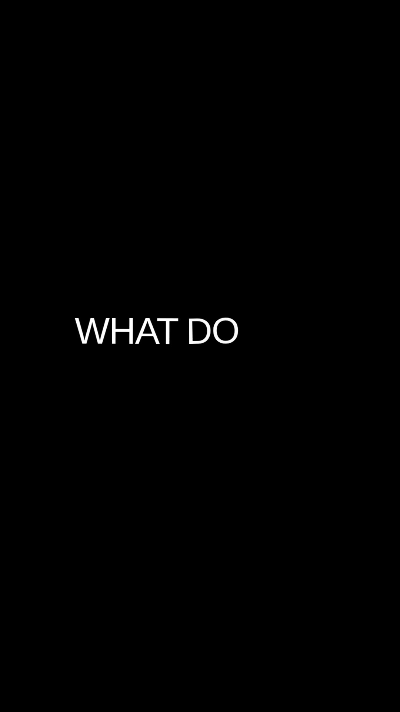
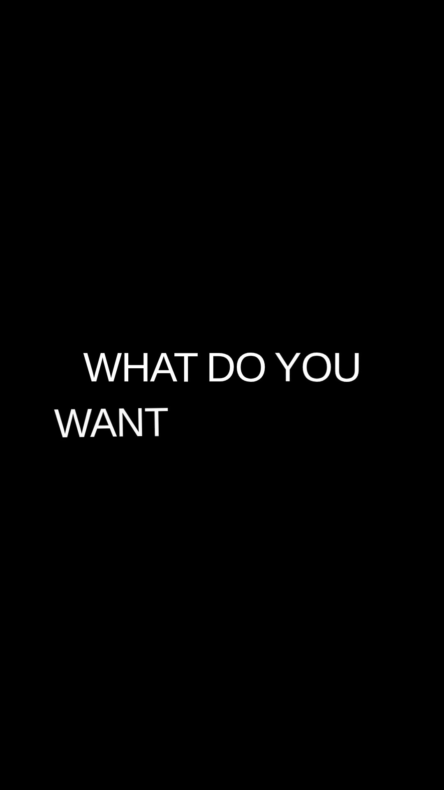
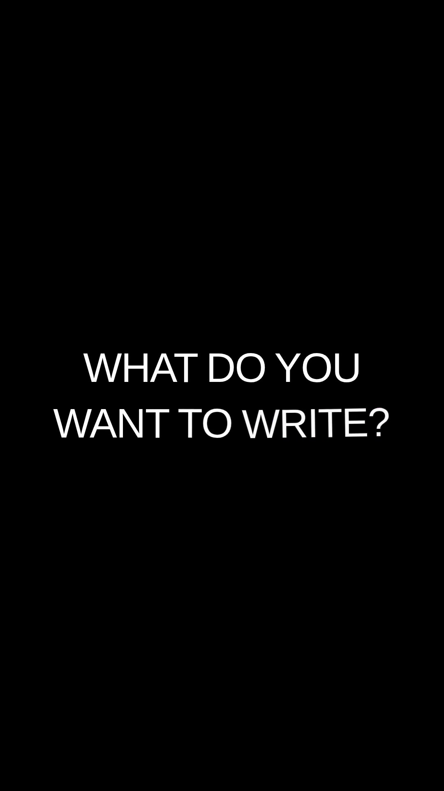
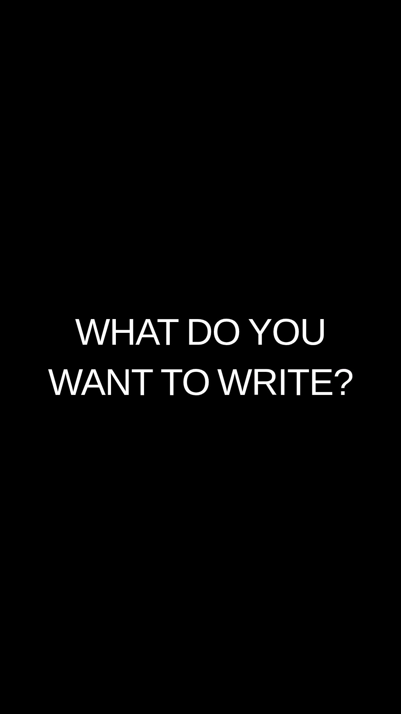

# Minimalist Kinetic Typographic Prompt Sequence

A vertical minimalist video demonstrating animated text sequences against a black background. Short phrases snap in word-by-word with slight angular drift and color accents before settling into centered white sans-serif layouts.

HIGH / 10 FPS. Visual-only prompt. Field name normalized; content unchanged.

## Staggered Kinetic Word Assembly (2–3.7s)

**communication problem:** Displaying multiple words simultaneously can cause cognitive overload, while simple fades lack punch and rhythm.

**creative mechanism:** Each word arrives sequentially along an offset angle and snaps quickly into line, matching speech cadence and guiding reading order dynamically.

**adaptation example:** A fintech app onboarding screen revealing key value propositions word-by-word timed with audio narration.

**do not transfer:** Rapid succession without pause can be hard to read for longer sentences.

**interpretation caveat:** Relies entirely on text pacing; effectiveness depends on synchronization with voiceover or music.

**observed sequence:** Individual words enter rapidly along skewed paths with partial opacity or accent colors, sequentially docking into a clean horizontal sentence.

## Fingerprints

### narrative

- 0.5–13.8s: Text phrases build sequentially: introducing 'TEXT ANIMATION', followed by conversational prompts like 'WHAT DO YOU WANT TO WRITE?', 'EVERYTHING YOU WANT,', 'STANDING IN FRONT OF YOU.', 'VERY EASY, AND FAST.', 'SIT BACK AND RELAX', and concluding with 'WHAT YOU ARE LOOKING FOR? THERE YOU HAVE IT!'. (high; Text sequencing reflects on-screen copy only; narrative purpose beyond typography demo is unverified.)

### editing

- 0–14.5s: Discrete typographic cards are separated by brief black holds or cut directly after completing the sentence layout. (high; Cut timings are sampled at key intervals.)

### product_presentation

### motion

- 0.5–3.7s: Words fly in rapidly from angles, sliding along a trajectory with rotation before snapping into a straight, locked baseline and tracking position. (high; Exact easing and rotation parameters cannot be mathematically determined from the video.)
- 7–8.7s: Specific accent words enter with subtle purple coloring and angle offsets before shifting to uniform white alignment. (high; Some words retain purple styling temporarily before settling.)

### graphics

- 0–14s: High-contrast monochrome presentation featuring centered, bold, sans-serif white capital letters on a pure solid black canvas, occasionally accented by light purple. (high; Font family cannot be verified from appearance.)

## Uncertainties

- Whether the animation is an automated preset template or manually keyframed typography.
- Audio track presence or synchronization cannot be confirmed purely from silent visual review.